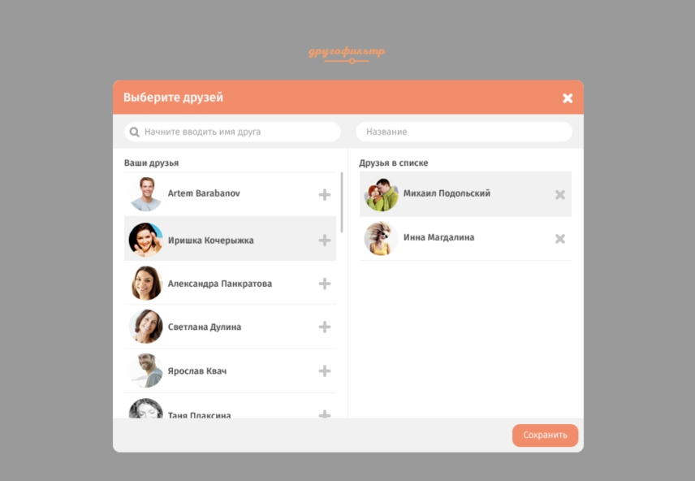

# Другофильтр 

Приложение представляет из себя два списка. 

В левом списке перечислены все ваши друзья ВКонтакте. В правом писке только те друзья, которых вы выберете. 

Друзей можно перемещать между списками двумя способами: 
* Drag&Drop
* Нажимая на "+" рядом с другом (возвращать друзей в левый список можно, нажимая на "х" рядом с другом)

В обоих списках можно осуществлять поиск друга по его имени и фамилии. 

При нажатии на кнопку "сохранить" оба списка сохраняютя в LocalStorage. При следующей загрузке страницы оба списка должны быть восстановлены. 

Запрещено использовать фреймворки и библиотеки. Можно использовать шаблонизатор и VK SDK. 

## Доступные команды

* `npm install` - установить зависимости
* `npm run prepare` - запустить тесты и проверить стиль кода
* `npm run test` - запустить тесты
* `npm run codestyle` - проверить стиль кода
* `npm run start` - запустить встроенный сервер и следить за изменениями файлов
* `npm run build` - собрать проект в папку `build`
